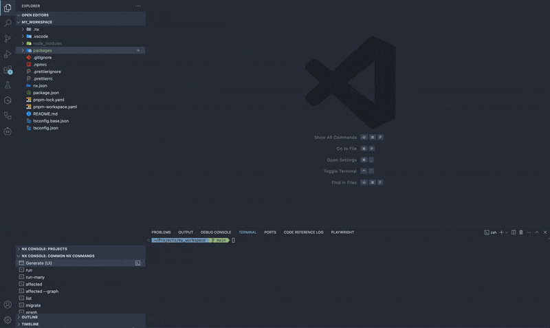

<div align="center">
  <h1>NX plugin for AWS - @aws/nx-plugin</h1>
  <h3>Quickly bootstrap and build AWS projects easily</h3>
  <a href="https://opensource.org/licenses/Apache-2.0">
    
  </a>
  <a href="https://codecov.io/gh/awslabs/nx-plugin-for-aws">
    
  </a>
  <a href="https://gitpod.io/new/?workspaceClass=g1-large#https://github.com/awslabs/nx-plugin-for-aws">
    
  </a>
  <a href="https://github.com/awslabs/nx-plugin-for-aws/actions/workflows/ci.yml">
    
  </a>
  <a href="https://github.com/awslabs/nx-plugin-for-aws/commits/main">
    
  </a>
  <br />
  <br />
  <figure>
    
  </figure>
  👉 See full documentation on <a href="https://awslabs.github.io/nx-plugin-for-aws">https://awslabs.github.io/nx-plugin-for-aws</a> 👈
</div>

## Intro

[@aws/nx-plugin](https://github.com/awslabs/nx-plugin-for-aws) is a collection of generators to help you build cloud-native applications with AWS.

## Key Features

- **Declarative**: Generate code that follows best practices for AWS cloud development.
- **Component-Based**: Add components to your project as needed, from React websites to serverless APIs using either the CLI or UI.
- **Learn Once, Use Anywhere**: Consistent patterns across different AWS services and application types.
- **Open for modification**: All code generated is your code and can be edited as you see fit.
- **Type safety**: Type-safety is employed to support IDE completions and reduce the number of runtime errors encountered.
- **Minimal dependencies**: Getting up and running is simple and only requires langugage level global dependencies.

## Available Generators

- `ts#project` - Generate a new TypeScript library.
- `ts#infra` - Generate a Typescript AWS CDK infrastructure project for your application.
- `ts#cloudscape-website` - Generate a new Cloudscape/React/Vite based web application.
- `ts#cloudscape-website#auth` - Add AWS Cognito authentication to your Cloudscape website.
- `ts#trpc-api` - Generate a tRPC backend service with Amazon API Gateway/AWS Lambda integrations and [AWS Powertools](https://github.com/aws-powertools/powertools-lambda-typescript) pre-configured.
- `ts#nx-generator` - Add an [Nx Generator](https://nx.dev/features/generate-code) to a TypeScript project.
- `ts#mcp-server` - Generate a [Model Context Protocol (MCP)](https://modelcontextprotocol.io/) server in TypeScript.
- `py#project` - Generate a uv based Python project.
- `py#fast-api` - Generate a FastAPI backend service with [AWS Powertools](https://github.com/aws-powertools/powertools-lambda-python) pre-configured.
- `py#lambda-function` - Add a lambda function to an existing python project with optional type-safe event sources.
- `api-connection` - Connect frontend applications to backend APIs.
- `license` - Automatically manage LICENSE files and source code headers in your workspace.

## Getting started

@aws/nx-plugin has been designed for gradual adoption from the start, and **you can use as little or as much of it as you need**.

1. Create a new NX workspace

```bash
npx create-nx-workspace@~20.6.3 demo --pm=pnpm --preset=ts --ci=skip --formatter=prettier
cd demo
```

2. Install the `@aws/nx-plugin`

```bash
pnpm add -Dw @aws/nx-plugin
```

3. Add components:

```bash
# Generate a tRPC API backend
pnpm nx g @aws/nx-plugin:ts#trpc-api

# Generate a Cloudscape website
pnpm nx g @aws/nx-plugin:ts#cloudscape-website

# Connect the frontend to the backend
pnpm nx g @aws/nx-plugin:api-connection

# Add authentication to your website
pnpm nx g @aws/nx-plugin:ts#cloudscape-website#auth

# Generate AWS CDK infrastructure
pnpm nx g @aws/nx-plugin:ts#infra
```

### Additional resources

- Use [Quick Start](https://awslabs.github.io/nx-plugin-for-aws/get_started/quick-start/) to get a taste of @aws/nx-plugin.
- [Build a Dungeon Adventure Game](https://awslabs.github.io/nx-plugin-for-aws/get_started/tutorials/dungeon-game/overview/) to get an in-depth guided tutorial on how to use the @aws/nx-plugin.
- [Add @aws/nx-plugin to your existing project](https://awslabs.github.io/nx-plugin-for-aws/get_started/tutorials/existing-project/)

## Documentation Translation

The project supports automatic translation of documentation using AWS Bedrock's Deepseek & Haiku 3.5 models. Documentation is translated from English to multiple languages (currently Japanese, with support for French, Spanish, German, Chinese, and Korean).

> **_NOTE:_** It is important that only files in english (en folder) are modified directly as the translated files are generating using english as a base.

### Running Translations Locally

> **_NOTE:_** Ensure you have your aws cli configured to an AWS account with DeepSeek/Haiku 3.5 Bedrock model access before continuing.

To translate documentation locally:

```bash
# Translate only changed files
pnpm tsx ./scripts/translate.ts

# Translate all files
pnpm tsx ./scripts/translate.ts --all

# Translate to specific languages
pnpm tsx ./scripts/translate.ts --languages jp,fr,es

# Show what would be translated without actually translating
pnpm tsx ./scripts/translate.ts --dry-run
```

### GitHub Workflow

A GitHub workflow automatically translates documentation when changes are made to English documentation files in pull requests. The workflow:

1. Detects changes to English documentation files
2. Translates the changed files using DeepSeek and Haiku 3.5 on AWS Bedrock
3. Commits the translations back to the source branch
4. Updates the PR with files translated

## Contributing

The main purpose of this repository is to continue evolving @aws/nx-plugin, making it faster and easier to use. Development happens in the open on GitHub, and we are grateful to the community for contributing bugfixes and improvements.

Read our [Contributing Guide](/CONTRIBUTING.md) to learn about our development process, how to propose bugfixes and improvements, and how to build and test your changes to @aws/nx-plugin.

## Code of Conduct

This project has adopted a Code of Conduct that we expect project participants to adhere to. Please read the [Code of Conduct](/CODE_OF_CONDUCT.md) so that you can understand what actions will and will not be tolerated.

## License

@aws/nx-plugin is [Apache 2.0 licensed](/LICENSE).
