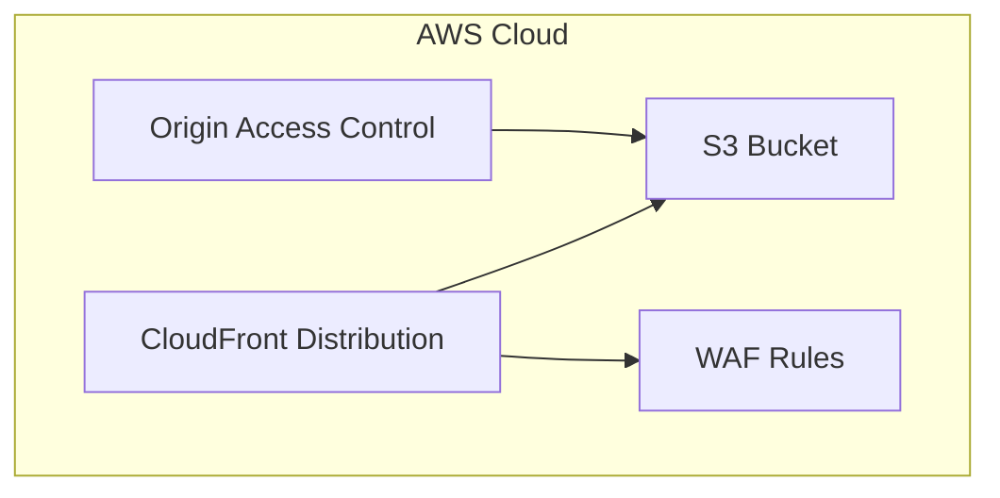

# Cloudscape Website App Generator

## Overview
This generator creates a new Cloudscape React application with AWS CDK infrastructure setup. The generated application uses Vite as the build tool and bundler, providing fast development and optimized production builds. The codebase is structured using ES Modules (ESM) for modern JavaScript module system compatibility. It sets up a complete web application using AWS Cloudscape Design System components and configures the necessary build tools and dependencies.

## Usage

You can generate a new Cloudscape website application in two ways:

### 1. Using VSCode IDE

First, install the NX Console extension for VSCode:
1. Open VSCode
2. Go to Extensions (Ctrl+Shift+X / Cmd+Shift+X)
3. Search for "Nx Console"
4. Install [Nx Console](https://marketplace.visualstudio.com/items?itemName=nrwl.angular-console)

Then generate your application:
1. Open the NX Console in VSCode
2. Click on "Generate"
3. Search for "cloudscape-website#app"
4. Fill in the required parameters in the form
5. Click "Run"

### 2. Using CLI

Generate the application:
```bash
nx g @aws/nx-plugin:cloudscape-website#app my-website --directory=apps/web
```

You can also perform a dry-run to see what files would be generated without actually creating them:
```bash
nx g @aws/nx-plugin:cloudscape-website#app my-website --directory=apps/web --dry-run
```

Both methods will create a new Cloudscape website application in `apps/web/my-website` with all the necessary configuration and infrastructure code.

## Input Parameters

| Parameter | Type | Default | Description |
|-----------|------|---------|-------------|
| name* | string | - | The name of the application (required). Must start with a letter and not contain colons. |
| directory | string | "packages" | The directory to store the application in. |
| style | string | "css" | The file extension for style files. Options: css, scss, less, tailwind, styled-components, @emotion/styled, styled-jsx, none |
| unitTestRunner | string | "vitest" | Test runner for unit tests. Options: jest, vitest, none |
| bundler | string | "vite" | The bundler to use. Options: vite, webpack, rspack |
| compiler | string | "swc" | The compiler to use. Options: babel, swc |
| linter | string | "eslint" | The tool for running lint checks. Options: eslint, none |
| classComponent | boolean | false | Use class components instead of functional components |
| strict | boolean | true | Creates an application with strict mode and strict type checking |
| js | boolean | false | Generate JavaScript files instead of TypeScript files |
| minimal | boolean | false | Generate a React app with minimal setup, no separate test files |

*Required parameter

## Expected Output

The generator creates two main components:

### 1. React Application Code
```
<directory>/<name>/
├── src/
│   ├── main.tsx           # Application entry point with React setup
│   ├── config.ts          # Application configuration
│   ├── layouts/           # Layout components
│   └── pages/            # Page components for routing
├── public/               # Static assets
├── tsconfig.json        # TypeScript configuration
├── vite.config.ts       # Vite bundler configuration
├── project.json         # Project configuration and build targets
└── index.html          # HTML entry point
```

### 2. Infrastructure Code
```
common/constructs/
├── src/
│   ├── <name>/           # Infrastructure specific to this website
│   │   └── index.ts      # Website infrastructure stack
│   │   └── static-website.ts # Contains the StaticWebsite construct
│   │   └── cloudfront-web-acl.ts # Sets up the ACL
│   │   └── webacl_event_handler # Custom resource to support cross region ACL deployment
│   └── index.ts          # Exports for all constructs
├── tsconfig.json         # TypeScript configuration
└── project.json         # Project configuration and build targets
```

Additionally, it:
1. Configures build settings for production deployment
2. Installs required dependencies:
   - @aws-northstar/ui
   - @cloudscape-design/components
   - @cloudscape-design/board-components
   - react-router-dom
   - aws-cdk-lib
   - constructs
   - cdk-nag

## Infrastructure Architecture



The infrastructure stack deploys:
1. **CloudFront Distribution**
   - Global content delivery network
   - Edge caching for static assets
   - HTTPS enabled by default

2. **S3 Bucket**
   - Static website content hosting
   - Private access through CloudFront
   - Versioning enabled

3. **WAF (Web Application Firewall)**
   - Web exploit protection
   - Rate limiting
   - IP-based filtering

4. **Origin Access Control**
   - Secure S3 bucket access
   - Restricted to CloudFront only

## Using the StaticWebsite Construct

After generating the application, you can use the generated `StaticWebsite` construct in your CDK code:

```typescript
import { App, Stack } from 'aws-cdk-lib';
import { StaticWebsite } from ':my-org/common-constructs';

export class MyWebsiteStack extends Stack {
  constructor(scope: App, id: string) {
    super(scope, id);

    // Create the static website with the pre-configured setup
    new StaticWebsite(this, 'MyWebsite');
  }
}
```

The StaticWebsite construct is pre-configured with:
- S3 bucket for hosting website content
- CloudFront distribution with Origin Access Control
- WAF rules for security
- Cross-region support for WAF configuration

Since all the infrastructure code is generated in your project's `common/constructs` directory, you have full control to customize the implementation. You can modify:
- `static-website.ts` to adjust the CloudFront distribution settings or S3 bucket configuration
- `cloudfront-web-acl.ts` to customize WAF rules and rate limiting
- `webacl_event_handler` to modify the cross-region WAF deployment behavior

The generated code serves as a starting point that you can adapt to your specific requirements.

## Runtime Configuration

The generator includes a RuntimeConfig system that bridges your infrastructure and frontend application. This system allows you to:

1. **Share Configuration**: Pass runtime configuration from your infrastructure to your React application
2. **Type Safety**: Configuration is fully typed using TypeScript interfaces
3. **Context-Based Access**: Access configuration anywhere in your React components using React Context

### Infrastructure Usage

In your CDK code, you can set runtime configuration using the RuntimeConfig construct:

```typescript
import { RuntimeConfig } from ':my-org/common-constructs';

export class MyWebsiteStack extends Stack {
  constructor(scope: App, id: string) {
    super(scope, id);

    // Get or create the RuntimeConfig instance
    const runtimeConfig = RuntimeConfig.ensure(this);

    // Set configuration values
    runtimeConfig.config.myFeature = {
      apiEndpoint: 'https://api.example.com',
      region: Stack.of(this).region
    };
  }
}
```

### Frontend Usage

In your React components, you can access the runtime configuration using the RuntimeConfigContext:

```typescript
import { useContext } from 'react';
import { RuntimeConfigContext } from './components/RuntimeConfig';

const MyComponent = () => {
  const runtimeConfig = useContext(RuntimeConfigContext);

  return (
    <div>
      <p>API Endpoint: {runtimeConfig?.myFeature?.apiEndpoint}</p>
      <p>Region: {runtimeConfig?.myFeature?.region}</p>
    </div>
  );
};
```

The RuntimeConfigProvider is automatically set up in your application's entry point:

```typescript
import RuntimeConfigProvider from './components/RuntimeConfig';

const App = () => (
  <RuntimeConfigProvider>
    <BrowserRouter>
      {/* Your app components */}
    </BrowserRouter>
  </RuntimeConfigProvider>
);
```

This configuration system is particularly useful when:
- Integrating with AWS services that require runtime configuration (e.g., Cognito, API Gateway)
- Managing environment-specific settings
- Sharing infrastructure outputs with your frontend application

## Building the Application

### Development Build
To run the application in development mode with hot-reload:
```bash
nx serve my-website
```

### Production Build
To create a production build:
```bash
nx build my-website
```

All built code is located in the `dist` folder at the root of your workspace. For example, if your application is in `apps/web/my-website`, the built code will be in `dist/apps/web/my-website`.

The production build:
- Minifies JavaScript and CSS
- Optimizes assets
- Generates source maps
- Creates a deployment-ready bundle