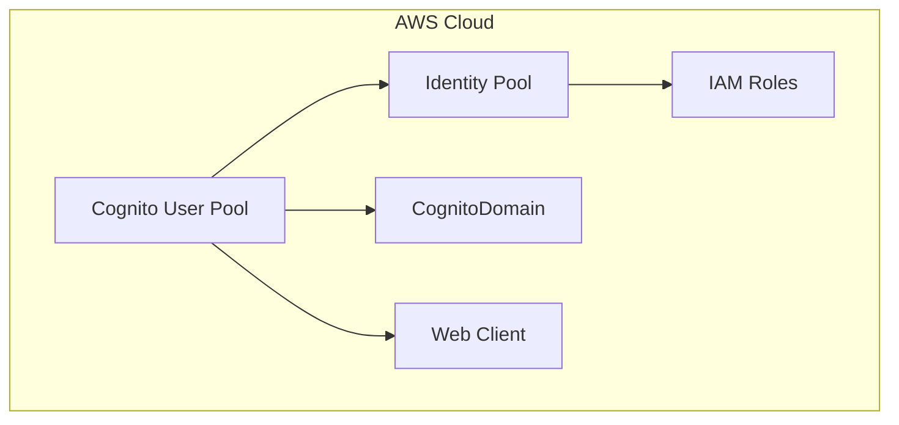

# Cognito Auth Generator

## Overview

This generator adds AWS Cognito authentication to an existing Cloudscape React application. It sets up the necessary components and infrastructure for user authentication using Amazon Cognito hosted UI, including sign-in, sign-up, and password recovery flows. The generator integrates seamlessly with the Cloudscape Design System components and configures all required AWS resources through CDK.

## Prerequisites

Before using this generator, ensure your project meets these requirements:

1. The project must have a `main.tsx` file in its source directory
2. The `main.tsx` file must contain a `<RuntimeConfigProvider>` element
3. The project must be a valid Cloudscape application

Example of required `main.tsx` structure:

```typescript
import { RuntimeConfigProvider } from './components/RuntimeConfig';

const App = () => <RuntimeConfigProvider>{/* Your app components */}</RuntimeConfigProvider>;
```

If these prerequisites are not met, the generator will fail with an error.

## Usage

You can add Cognito authentication to your Cloudscape website in two ways:

### 1. Using VSCode IDE

First, install the NX Console extension for VSCode:

1. Open VSCode
2. Go to Extensions (Ctrl+Shift+X / Cmd+Shift+X)
3. Search for "Nx Console"
4. Install [Nx Console](https://marketplace.visualstudio.com/items?itemName=nrwl.angular-console)

Then add authentication:

1. Open the NX Console in VSCode
2. Click on "Generate"
3. Search for "ts#cloudscape-website#cognito-auth"
4. Fill in the required parameters:
   - project: Your existing Cloudscape application name
   - allowSignup: Whether to enable self-signup (optional)
5. Click "Run"

### 2. Using CLI

Add authentication to your existing Cloudscape application:

```bash
nx g @aws/nx-plugin:ts#cloudscape-website#cognito-auth --project=my-cloudscape-app --cognito-domain=<your-domain-prefix>
```

Enable self-signup:

```bash
nx g @aws/nx-plugin:ts#cloudscape-website#cognito-auth --project=my-cloudscape-app --allowSignup=true --cognito-domain=<your-domain-prefix>
```

You can also perform a dry-run to see what files would be generated without actually creating them:

```bash
nx g @aws/nx-plugin:ts#cloudscape-website#cognito-auth --project=my-cloudscape-app --cognito-domain=<your-domain-prefix> --dry-run
```

All methods will add Cognito authentication to your existing Cloudscape website application with all the necessary components and infrastructure code.

## Input Parameters

| Parameter       | Type    | Default | Description                                                 |
| --------------- | ------- | ------- | ----------------------------------------------------------- |
| project\*       | string  | -       | The root directory of the Cloudscape application (required) |
| cognitoDomain\* | string  | -       | domain prefix when creating the Cognito Hosted UI           |
| allowSignup     | boolean | false   | Whether to allow self-signup                                |

\*Required parameter

## Expected Output

The generator adds authentication-related components and infrastructure:

### 1. React Components

```
<directory>/<websiteProject>/
├── src/
    └── components/
    |   └── CognitoAuth/
    |       └── index.tsx         # Main authentication component
    └── layouts/
        └── App/
            └── index.tsx         # Updates this file to add auth support

```

### 2. Infrastructure Code

```
common
    └── constructs/
        └── src/
            └── core/
                └── index.ts              # Adds export for identity construct
                └── user-identity.ts      # Main identity construct
    └── types/
        └── src/
            └── runtime-config.ts         # Updates IRuntimeConfig to add cognitoProps
```

Additionally, it:

1. Installs required dependencies:
   - aws-cdk-lib
   - constructs
   - @aws-cdk/aws-cognito-identitypool-alpha
   - react-oidc-context
   - oidc-client-ts
2. Updates the application's runtime configuration to include Cognito settings
3. Automatically integrates the authentication component into your website code

## Infrastructure Architecture



The infrastructure stack adds:

1. **Cognito User Pool**

   - User directory management
   - Sign-up and sign-in flows
   - MFA configuration

2. **Cognito Identity Pool**

   - Federated identities
   - AWS credentials mapping
   - IAM role assignment

3. **Web Client**

   - User Password and SRP auth flows
   - Token handling

4. **Cognito Domain**
   - Domain configured using the cognitoDomain provided

## Authentication Components

The generator automatically sets up authentication in your application by:

1. Importing the CognitoAuth component in main.tsx
2. Wrapping your application with the CognitoAuth component inside the RuntimeConfigProvider
3. Configuring authenticated using the Cognito hosted UI
4. Updating the layout add add a singout button and display the logged in user.

No manual setup is required as the generator handles all the necessary component integration.

## Runtime Configuration

The generator automatically integrates with the RuntimeConfig system to provide Cognito configuration:

### Infrastructure Usage

```typescript
import { UserIdentity } from ':my-org/common-constructs';
import { Stack } from 'aws-cdk-lib';
import { Construct } from 'constructs';

export class MyWebsiteStack extends Stack {
  constructor(scope: Construct, id: string) {
    super(scope, id);

    // Create the Cognito authentication resources
    new UserIdentity(this, 'Identity');

    // The runtime config is automatically updated with Cognito settings
  }
}
```

### Frontend Usage

The CognitoAuth component automatically uses the runtime configuration.
