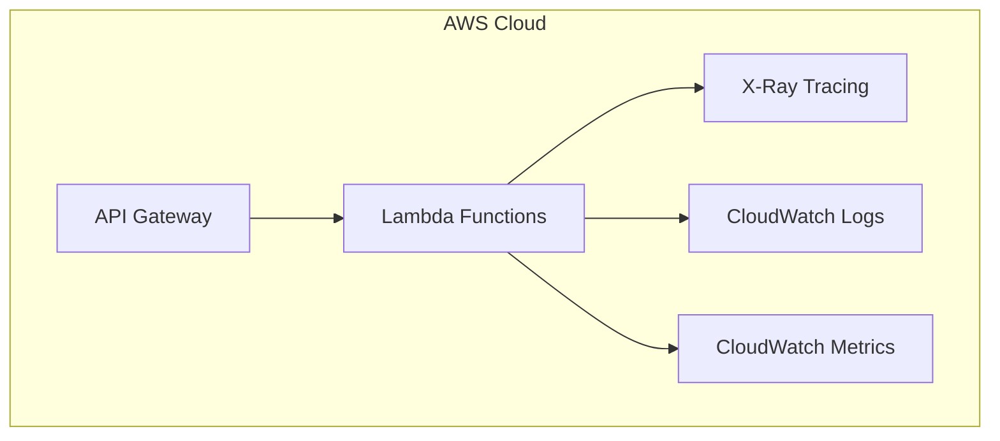

# tRPC Backend Generator

## Overview
This generator creates a new tRPC backend application with AWS CDK infrastructure setup. The generated backend uses AWS Lambda for serverless deployment and includes schema validation using Zod. The codebase is structured using ES Modules (ESM) for modern JavaScript module system compatibility. It sets up a complete type-safe API using tRPC with AWS Lambda integration, AWS X-Ray tracing, and AWS Lambda Powertools for observability.

## Usage

You can generate a new tRPC backend in two ways:

### 1. Using VSCode IDE

First, install the NX Console extension for VSCode:
1. Open VSCode
2. Go to Extensions (Ctrl+Shift+X / Cmd+Shift+X)
3. Search for "Nx Console"
4. Install [Nx Console](https://marketplace.visualstudio.com/items?itemName=nrwl.angular-console)

Then generate your API:
1. Open the NX Console in VSCode
2. Click on "Generate"
3. Search for "trpc#backend"
4. Fill in the required parameters in the form
5. Click "Run"

### 2. Using CLI

Generate the API:
```bash
nx g @aws/nx-plugin:trpc#backend my-api --apiNamespace=@myorg --directory=apps/api
```

You can also perform a dry-run to see what files would be generated without actually creating them:
```bash
nx g @aws/nx-plugin:trpc#backend my-api --apiNamespace=@myorg --directory=apps/api --dry-run
```

Both methods will create a new tRPC backend API in the specified directory with all the necessary configuration and infrastructure code.

## Input Parameters

| Parameter | Type | Default | Description |
|-----------|------|---------|-------------|
| apiName* | string | - | The name of the API (required). Used to generate class names and file paths. |
| apiNamespace* | string | - | The namespace for the API (required). Must be in the format @scope or @scope/subscore. |
| directory | string | "packages" | The directory to store the application in. |
| unitTestRunner | string | "vitest" | Test runner for unit tests. Options: jest, vitest, none |

*Required parameter

## Expected Output

The generator creates three main components:

### 1. Backend API Code
```
<directory>/<api-name>/backend/
├── src/
│   ├── index.ts           # Backend entry point with tRPC setup
│   └── lambdas/          # Lambda function handlers
│       ├── index.ts      # Lambda exports
│       ├── router.ts     # tRPC router definition
│       └── middleware.ts # Middleware plugins
├── tsconfig.json        # TypeScript configuration
└── project.json        # Project configuration and build targets
```

### 2. Schema Code
```
<directory>/<api-name>/schema/
├── src/
│   └── index.ts          # Shared schema definitions using Zod
├── tsconfig.json        # TypeScript configuration
└── project.json        # Project configuration and build targets
```

### 3. Infrastructure Code
```
common/constructs/
├── src/
│   ├── <api-name>/       # Infrastructure specific to this API
│   │   └── index.ts      # API infrastructure stack
│   └── index.ts          # Exports for all constructs
├── tsconfig.json         # TypeScript configuration
└── project.json         # Project configuration and build targets
```

Additionally, it:
1. Configures build settings for production deployment
2. Installs required dependencies:
   - @trpc/server
   - zod
   - aws-xray-sdk-core
   - aws-cdk-lib
   - constructs
   - @aws-lambda-powertools/logger
   - @aws-lambda-powertools/metrics
   - @aws-lambda-powertools/tracer

## Router and Middleware Setup

The generator creates a powerful tRPC router setup with integrated middleware for observability and error handling.

### Router Configuration

The router is configured in `router.ts` with AWS Lambda integration:

```typescript
import { initTRPC } from '@trpc/server';
import { awsLambdaRequestHandler } from '@trpc/server/adapters/aws-lambda';
import {
  createErrorPlugin,
  createLoggerPlugin,
  createMetricsPlugin,
  createTracerPlugin,
  IMiddlewareContext,
} from './middleware.js';

// Initialize tRPC with context type
export type Context = IMiddlewareContext;
const t = initTRPC.context<Context>().create();

// Create base router and procedure which automatically instruments all middleware
export const router = t.router;
export const publicProcedure = t.procedure
  .unstable_concat(createLoggerPlugin().loggerPlugin)
  .unstable_concat(createTracerPlugin().tracerPlugin)
  .unstable_concat(createMetricsPlugin().metricsPlugin)
  .unstable_concat(createErrorPlugin().errorPlugin);

// Define your procedures here
const appRouter = router({
  echo: publicProcedure
    .input(z.string())
    .output(EchoSchema)
    .query((opts) => ({ result: opts.input })),
});

// Create Lambda handler
export const handler = awsLambdaRequestHandler({
  router: appRouter
});

// Import this type in the frontend when setting up your integration
export type AppRouter = typeof appRouter;
```

### Middleware and Context

The generator includes four powerful middleware plugins whcih are automatically instrumented:

1. **Logger Plugin**
   - Automatically logs procedure execution
   - Captures errors with detailed context
   - Uses structured logging format

2. **Metrics Plugin**
   - Captures cold start metrics
   - Tracks request counts
   - Records success/error metrics
   - Automatically publishes metrics to CloudWatch

3. **Tracer Plugin**
   - Integrates with AWS X-Ray
   - Creates subsegments for each procedure
   - Annotates cold starts
   - Adds error metadata automatically

4. **Error Plugin**
   - Standardizes error handling
   - Converts internal errors to tRPC errors
   - Maintains error context for debugging

### Using Context in Procedures

You can access the context in your procedures to utilize the observability tools:

```typescript
const appRouter = router({
  getData: publicProcedure
    .input(z.string())
    .query(async (opts) => {
      // Access logger
      opts.ctx.logger.info('Processing getData request', {
        input: opts.input
      });

      // Add custom metrics
      opts.ctx.metrics.addMetric('getData.calls', MetricUnit.Count, 1);

      // Use tracer for subsegments
      return opts.ctx.tracer.captureMethod('getData.process', async () => {
        // Your business logic here
        return { data: 'result' };
      });
    }),
});
```

## Infrastructure Architecture



The infrastructure stack deploys:
1. **API Gateway**
   - HTTP API endpoint
   - Request validation
   - CORS configuration

2. **Lambda Functions**
   - Serverless compute
   - Auto-scaling
   - Pay-per-use pricing

3. **Observability**
   - X-Ray distributed tracing
   - CloudWatch Logs integration
   - CloudWatch Metrics via Lambda Powertools
   - Structured logging with Lambda Powertools


## Using the Generated CDK Constructs

After generating your tRPC backend, you'll find a CDK construct in the `common/constructs` directory. Here's how to use it in your infrastructure:

### Basic Usage

```typescript
import { Stack } from 'aws-cdk-lib';
import { MyApi } from ':my-org/common-constructs';
import { HttpNoneAuthorizer } from '@aws-cdk-lib/aws-apigatewayv2-authorizers';

export class MyStack extends Stack {
  constructor(scope: App, id: string) {
    super(scope, id);

    // Create the API with no authentication
    const api = new MyApi(this, 'MyApi', {
      defaultAuthorizer: new HttpNoneAuthorizer(),
      allowedOrigins: ['http://localhost:4200']
    });
  }
}
```

### With Cognito Authentication

```typescript
import * as cdk from 'aws-cdk-lib';
import { Construct } from 'constructs';
import { UserIdentity, MyApi } from ':my-org/common-constructs'
import { HttpIamAuthorizer } from 'aws-cdk-lib/aws-apigatewayv2-authorizers';

export class ApplicationStack extends cdk.Stack {
  constructor(scope: Construct, id: string, props?: cdk.StackProps) {
    super(scope, id, props);

    const identity = new UserIdentity(this, 'UserIdentity');
    const myapi = new MyApi(this, 'MyApi', {
      defaultAuthorizer: new HttpIamAuthorizer(),
    });
    myapi.grantInvokeAccess(identity.identityPool.authenticatedRole);
  }
}
```

### Granting Access to Other Services

```typescript
import { Stack } from 'aws-cdk-lib';
import { MyApi } from ':my-org/common-constructs';
import { Role } from '@aws-cdk-lib/aws-iam';

export class MyStack extends Stack {
  constructor(scope: App, id: string) {
    super(scope, id);

    const api = new MyApi(this, 'MyApi', {
      // ... configuration
    });

    // Grant access to other roles if needed
    const consumerRole = new Role(this, 'ConsumerRole', {
      // ... role configuration
    });
    
    api.grantInvokeAccess(consumerRole);
  }
}
```

The API URL will be automatically registered in the RuntimeConfig system and can be accessed in your frontend application.

## Schema Code and Zod

The generator creates a separate schema package that uses [Zod](https://zod.dev), a TypeScript-first schema declaration and validation library. This package can be shared between your backend and frontend code to ensure type safety across your entire application.

### Introduction to Zod

Zod is a schema declaration and validation library designed specifically for TypeScript. It allows you to:
- Define schemas with a fluent API
- Automatically infer TypeScript types from schemas
- Validate data at runtime
- Create complex nested schemas
- Transform data during validation

For complete documentation, visit the [Zod documentation](https://zod.dev).

### Defining Schemas

The generator creates a basic schema structure that you can extend:

```typescript
import { z } from 'zod';

// Basic object schema
export const UserSchema = z.object({
  id: z.string().uuid(),
  email: z.string().email(),
  name: z.string().min(2),
  age: z.number().min(0).optional(),
});

// Infer the TypeScript type
export type User = z.infer<typeof UserSchema>;

// Input schema for creating a user
export const CreateUserSchema = UserSchema.omit({ id: true });

// Input schema for updating a user
export const UpdateUserSchema = CreateUserSchema.partial();

// Response schema for a list of users
export const UserListSchema = z.array(UserSchema);
```

### Common Schema Patterns

#### Nested Objects

```typescript
import { z } from 'zod';

export const AddressSchema = z.object({
  street: z.string(),
  city: z.string(),
  country: z.string(),
  postalCode: z.string(),
});

export const CustomerSchema = z.object({
  id: z.string().uuid(),
  name: z.string(),
  address: AddressSchema,
  shippingAddresses: z.array(AddressSchema),
});
```

#### Enums and Unions

```typescript
import { z } from 'zod';

export const OrderStatusSchema = z.enum([
  'pending',
  'processing',
  'shipped',
  'delivered'
]);

export const PaymentMethodSchema = z.union([
  z.object({ type: z.literal('credit_card'), cardNumber: z.string() }),
  z.object({ type: z.literal('paypal'), email: z.string().email() }),
]);

export const OrderSchema = z.object({
  id: z.string().uuid(),
  status: OrderStatusSchema,
  payment: PaymentMethodSchema,
});
```

#### Request/Response Schemas

```typescript
import { z } from 'zod';

// Pagination parameters
export const PaginationSchema = z.object({
  page: z.number().min(1),
  limit: z.number().min(1).max(100),
});

// Query parameters
export const SearchParamsSchema = z.object({
  query: z.string().min(1),
  filters: z.record(z.string()).optional(),
});

// API Response wrapper
export const ApiResponseSchema = <T extends z.ZodType>(dataSchema: T) =>
  z.object({
    success: z.boolean(),
    data: dataSchema,
    error: z.string().optional(),
    metadata: z.record(z.unknown()).optional(),
  });

// Usage example
export const GetUsersResponseSchema = ApiResponseSchema(
  z.object({
    users: z.array(UserSchema),
    total: z.number(),
  })
);
```

### Using Schemas with tRPC

Your schemas can be used directly in your tRPC procedures for input validation and type safety:

```typescript
import { router, publicProcedure } from './router';
import { 
  UserSchema,
  CreateUserSchema,
  UpdateUserSchema,
  SearchParamsSchema 
} from ':my-org/schema';

export const userRouter = router({
  // Create user with input validation
  create: publicProcedure
    .input(CreateUserSchema)
    .output(UserSchema)
    .mutation(async (opts) => {
      // Input is fully typed and validated
      const userData = opts.input;
      // ... create user logic
    }),

  // Search users with pagination
  search: publicProcedure
    .input(SearchParamsSchema.merge(PaginationSchema))
    .output(GetUsersResponseSchema)
    .query(async (opts) => {
      const { query, filters, page, limit } = opts.input;
      // ... search logic
    }),

  // Update user with partial data
  update: publicProcedure
    .input(z.object({
      id: z.string().uuid(),
      data: UpdateUserSchema,
    }))
    .output(UserSchema)
    .mutation(async (opts) => {
      const { id, data } = opts.input;
      // ... update logic
    }),
});
```

### Schema Best Practices

1. **Keep Schemas Centralized**: Store all schemas in the schema package to ensure they're easily shared between frontend and backend.

2. **Use Type Inference**: Let TypeScript infer types from your schemas instead of maintaining separate type definitions:
   ```typescript
   // Do this:
   export const UserSchema = z.object({ ... });
   export type User = z.infer<typeof UserSchema>;

   // Don't do this:
   export interface User { ... }
   export const UserSchema: z.ZodType<User> = z.object({ ... });
   ```

3. **Compose Schemas**: Build complex schemas by composing simpler ones:
   ```typescript
   const BaseUserSchema = z.object({
     email: z.string().email(),
     name: z.string(),
   });

   const AdminSchema = BaseUserSchema.extend({
     permissions: z.array(z.string()),
   });
   ```

4. **Version Your Schemas**: When making breaking changes, consider versioning your schemas:
   ```typescript
   export const UserSchemaV1 = z.object({ ... });
   export const UserSchemaV2 = UserSchemaV1.extend({ ... });
   ```

5. **Document Your Schemas**: Add JSDoc comments to explain complex validation rules:
   ```typescript
   export const ConfigSchema = z.object({
     /** 
      * API key must be in format: prefix_<32 chars>
      * Example: myapp_a1b2c3d4e5f6g7h8i9j0k1l2m3n4o5p6
      */
     apiKey: z.string().regex(/^[a-z]+_[a-f0-9]{32}$/),
   });
   ```

## Building the Application

To create a production build:
```bash
nx build @my-org/my-api
```

All built code is located in the `dist` folder at the root of your workspace. For example:
- Backend code: `dist/apps/api/my-api/backend`
- Schema code: `dist/apps/api/my-api/schema`

The production build:
- Bundles Lambda functions for optimal cold start performance
- Generates TypeScript declaration files
- Creates source maps for debugging
- Optimizes dependencies for AWS Lambda environment

## Troubleshooting

### `SyntaxError: Named export 'ListInferenceProfilesCommand' not found` or `TypeError: import_client_bedrock2.ListInferenceProfilesCommand is not a constructor`

If you see this error in a Lambda function related to `@aws-sdk`, it usually means that you are trying to use an operation which does not exist at runtime. This usually occurs when you are using the `@aws-sdk` provided by the Node Runtime. To bundle the required `@aws-sdk`, you can simply specify it in your `NodeJsFunction` as follows:

```typescript
new NodejsFunction(this, 'MyApiHandler', {
    ...,
    bundling: {
        bundleAwsSDK: true
    },
});
```

This will ensure that whichever `@aws-sdk` version you have installed locally will be the one that is used in the Lambda.

